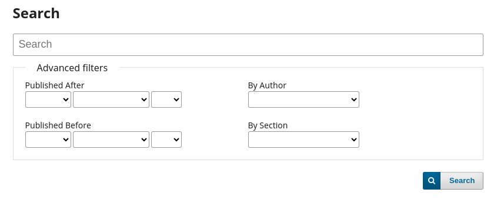

# Author and Section Search Filters Plugin

This plugin adds specific advanced filters to OJS search, giving users the ability to filter by a selected Author from a list of authors that contributed to the journal, and/or within a Section of the journal.

The new filters are added to the search area of the website and are available to all users:

## Compatibility

The latest release of this plugin is compatible with the following PKP applications:

OJS 3.4.0 and 3.5.0

## Plugin Download

To download the plugin, go to the Releases page and download the tar.gz package of the latest release compatible with your website.

## Installation

Enter the administration area of ​​your OJS website through the Dashboard.
Navigate to `Settings` > `Website` > `Plugins` > `Upload a new plugin`.

Under Upload file select the file `authorAndSectionSearchFilters.tar.gz`.

Click Save and the plugin will be installed on your website.

## Credits

This plugin was conceived and sponsored by [Nordicbysight](https://nordicbysight.se/).

Developed by [Lepidus Tecnologia](https://github.com/lepidus).

## License

This plugin is licensed under the GNU General Public License v3.0

_Copyright (c) 2024 Lepidus Tecnologia_
